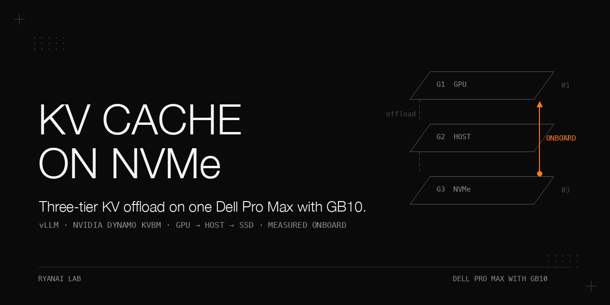

# KV cache on NVMe with NVIDIA Dynamo KVBM — one Dell Pro Max with GB10

> A minimal, measured test of three-tier KV-cache offload (GPU → host → SSD) on a single Dell Pro Max with GB10 (128 GB unified memory, sm_121, aarch64), using vLLM 0.27.1 and the standalone `kvbm` 1.4.2 wheel. The point of this cookbook is the **evidence**, not a recommendation: what works, what silently does not, and how to tell the difference in five minutes. Every number below comes from a JSON file in `results/`, and every log line from `results/logs/`.

## TL;DR

| Tier path | On this machine | Evidence |
|---|---|---|
| GPU → host (G2) offload, host → GPU onboard | **Works, and the answer is correct.** | Same 30K-token document after eviction: TTFT 9.03 s → 0.25 s, answer identical and correct, `kvbm_onboard_blocks_h2d` +971 in that step (`results/probe-kvbm-hostonly-8b-e1.json`) |
| GPU → host → SSD (G3) offload | Writes are counted (`kvbm_offload_blocks_h2d` +7536 per run) | — |
| SSD → GPU onboard | **Wrong KV, no error to the client.** | KVBM counts a full hit (`kvbm_onboard_blocks_d2d` +1884 = 30,156 tokens / 16), TTFT drops to 0.22 s, and the model answers with the **previous request's** content. Three variants, same result. Root cause below. |
| Hybrid GDN/Mamba models (Qwen3.5/3.8 family) | **Engine does not start.** | `ValueError: Failed to promote local KV cache specs to one unified type` — `DynamoConnector` does not implement `SupportsHMA` (`results/logs/27b-attempt1.log`) |

Two conclusions worth the whole exercise:

1. **On a unified-memory box the host tier buys no capacity.** The "host" 8 GB comes out of the same 128 GB the GPU KV pool would have used; it is a different eviction policy, not more memory. The only tier that could add capacity is the SSD — and that is the tier that does not work here.
2. **A fast TTFT after a cache hit proves nothing.** Assert the answer. Without the answer check, this probe would have reported a 40× speed-up as a success.

Scope: one machine, one image, one KVBM version, one dense 8B model. Nothing here says how KVBM behaves on hardware that has GPUDirect Storage.

## Hardware and software

| | |
|---|---|
| Machine | Dell Pro Max with GB10 (GB10, 128 GB unified LPDDR5X, sm_121, aarch64); disk cache on the local NVMe (ext4) |
| Driver / CUDA | 580.x / 13.0; **no `nvidia-fs` kernel module** (so no GPUDirect Storage) |
| Container | `vllm/vllm-openai:v0.27.1-aarch64-ubuntu2404` (vLLM 0.27.1, torch 2.13 cu130, NIXL 1.3.1) |
| KVBM | `kvbm==1.4.2` from PyPI (`manylinux_2_28_aarch64` wheel), installed with `--no-deps` |
| Models | `Qwen/Qwen3-8B` (dense, standard attention — the clean case); `Qwen3.8-27B-NVFP4` (GDN hybrid — the failure case) |

## Setup

Model weights live in `$HOME/models/<name>` on the host and are mounted at `/models` in the container. `scripts/kvbm-launch.sh` writes the serve command to a script and mounts it (the `--kv-transfer-config` JSON does not survive `bash -c "..."` quoting), then starts the container with the KVBM environment:

```bash
# inside the container the launcher runs:
pip install --no-deps kvbm==1.4.2         # --no-deps: kvbm pins nixl==1.0.1, which shadows the image's NIXL 1.3.1 and breaks vllm's nixl_ep import
vllm serve /models/Qwen3-8B --served-model-name qwen3-8b --port 8000 \
  --max-model-len 40960 --gpu-memory-utilization 0.20 --max-num-seqs 4 --max-num-batched-tokens 8192 \
  --enable-prefix-caching \
  --kv-transfer-config '{"kv_connector":"DynamoConnector","kv_role":"kv_both","kv_connector_module_path":"kvbm.vllm_integration.connector"}'
```

KVBM environment set by the launcher (worker container):

```
DYN_KVBM_CPU_CACHE_GB=<KVBM_CPU_GB, default 8>       # must be >= the engine's GPU KV pool, or KVBM churns (its own docs)
DYN_KVBM_DISK_CACHE_GB=<KVBM_DISK_GB, default 64>    # KVBM_DISK_GB=0 -> no disk tier
DYN_KVBM_DISK_CACHE_DIR=/kvbm-disk
DYN_KVBM_DISABLE_DISK_OFFLOAD_FILTER=true            # test only; by default a block must be hit twice before it is written to disk (SSD wear)
DYN_KVBM_METRICS=true  DYN_KVBM_METRICS_PORT=6880
```

The exact launcher invocation for each run in the results table:

```bash
# no KVBM (control)
./scripts/kvbm-launch.sh vllm-kvbm-8b /models/Qwen3-8B qwen3-8b 0.20 40960 0
# host tier only
KVBM_CPU_GB=8 KVBM_DISK_GB=0  ./scripts/kvbm-launch.sh vllm-kvbm-8b /models/Qwen3-8B qwen3-8b 0.20 40960 1
# host + disk (attempt 1)
KVBM_CPU_GB=8 KVBM_DISK_GB=64 ./scripts/kvbm-launch.sh vllm-kvbm-8b /models/Qwen3-8B qwen3-8b 0.20 40960 1
# host + disk, POSIX backend toggles (attempt 2)
KVBM_CPU_GB=8 KVBM_DISK_GB=64 KVBM_POSIX=true KVBM_GDS=false KVBM_GDS_MT=false ./scripts/kvbm-launch.sh vllm-kvbm-8b /models/Qwen3-8B qwen3-8b 0.20 40960 1
# host + disk, cuFile compat mode (attempt 3); scripts/cufile.compat.json copied to $HOME/kvbm-logs/cufile.json (mounted at /kvlogs)
KVBM_CPU_GB=8 KVBM_DISK_GB=64 KVBM_EXTRA_DOCKER_ARGS="-e CUFILE_ENV_PATH_JSON=/kvlogs/cufile.json -e CUFILE_FORCE_COMPAT_MODE=true" ./scripts/kvbm-launch.sh vllm-kvbm-8b /models/Qwen3-8B qwen3-8b 0.20 40960 1
```

Wait for `Application startup complete` in `docker logs -f vllm-kvbm-8b`. With `--gpu-memory-utilization 0.20` the engine reports `GPU KV cache size: 44,832 tokens` (45,088 without the connector) — one 30K-token document fits, four evict it.

## The probe

`scripts/kvbm_probe.py` sends the same ~30K-token document (A) twice, with N distinct 30K-token documents (E1..EN) in between to evict A from the GPU pool (N ≥ 2 also evicts it from the 8 GB host tier), and records per request:

- TTFT (monotonic time to the first streamed content token; temperature 0; thinking disabled)
- the answer to "what is the first code word in this document?" — the probe generated the document, so it knows the word; the answer's first alphabetic token must equal it
- the `kvbm_*` counters after the request and the delta **for that request alone**, so a hit is attributed to a tier rather than assumed
- stream completeness and `finish_reason`; exit code 0 = A2 correct, 2 = A2 wrong, 3 = a request failed

```bash
python3 scripts/kvbm_probe.py http://127.0.0.1:8000/v1 qwen3-8b --tokens 30000 --evict 4 --metrics http://127.0.0.1:6880/metrics --out results/my-run.json
```

The probe calibrates tokens-per-word with one request first (this vocabulary tokenizes at ~5.6 tokens/word). Keep `--tokens` under the engine's `--max-model-len`.

## Results

Qwen3-8B, 30,156-token document, `--evict 4` unless noted. All files in `results/`.

| Run | Tiers | Evict | A1 TTFT | A2 TTFT | A2 answer | KVBM counters over the run | File |
|---|---|---|---|---|---|---|---|
| no KVBM (control) | GPU only | 4 | 8.98 s | 9.13 s | `yankee` (correct) | — | `probe-kvbm-off-8b.json` ¹ |
| KVBM host only | GPU+host | 1 | 9.03 s | **0.25 s** | `yankee` (**correct**, identical) | onboard h2d +971 | `probe-kvbm-hostonly-8b-e1.json` |
| KVBM host only | GPU+host | 4 | 0.17 s ² | 9.19 s | `yankee` (correct) | host evicted → recompute | `probe-kvbm-hostonly-8b-e4.json` |
| KVBM host+disk, attempt 1 | GPU+host+SSD | 4 | 9.01 s | **0.22 s** | **`delta` — wrong** (E4's answer) | onboard d2d +1884 | `probe-kvbm-on-8b-nothink.json` |
| attempt 2: `DYN_KVBM_NIXL_BACKEND_POSIX=true`, GDS/GDS_MT off | same | 4 | 9.04 s | 0.23 s | `delta` — wrong | onboard d2d +1884 | `probe-kvbm-on-8b-posix.json` |
| attempt 3: cuFile compat mode | same | 4 | 9.08 s | 0.23 s | `delta` — wrong | onboard d2d +1884 | `probe-kvbm-on-8b-cufile-compat.json` |

¹ The control file was written by an earlier revision of the probe whose `expected` field still carried the numeric suffix (`yankee7028`); its `correct_*` flags are therefore `false` even though both answers are `yankee`. Judge it by `text_A1` / `text_A2`. The other files were written by the revision that stores the word stem. The current `scripts/kvbm_probe.py` additionally records per-request counter deltas, `finish_reason` and stream completeness; the committed files predate those fields.
² A was still resident in the host tier from the preceding run (same server), so A1 itself was a host hit; the interesting number in that row is A2 after four evictions.

## Why the SSD tier returns the wrong KV

**Verified from the logs** (`results/logs/8b-kvbm-on-attempt1.log`, identical in attempts 2 and 3):

```
gds_mt_backend.cpp:237] GDS_MT: failed to create file handle: GDS_MT: file register error: error=5027, fd=149    <- at startup, right after "DiskStorage created"
nixl_agent.cpp:921] createXferReq: no specified or potential backend had the required registrations to be able to do the transfer   <- at the moment of the A2 "hit"
dynamo_llm::block_manager::distributed::transfer: Failed to write to blocks: Other(Failed to create XferRequest)
dynamo_runtime::utils::tasks::critical: Critical task 'ZmqActiveMessageWorker: Handler for function: transfer_blocks' failed: Failed to create XferRequest
KVBM [worker-…] Cache Hit Rates - Host: 0.0% (0/11998), Disk: 15.7% (1884/11998)                                     <- KVBM still books the hit
```

The client got a 200 with the wrong answer; a later request then sat at `Running: 0 reqs, Waiting: 1 reqs, Deferred: 1 reqs` for minutes while `/health` kept returning 200.

**Inferred from the kvbm 1.4.2 source** (not verified by patching — treat as the most likely mechanism):

1. This machine has no `nvidia-fs`, so cuFile cannot register the cache file; the GDS_MT backend exists but cannot move data.
2. `build_agent(worker_id, need_disk)` in `lib/llm/src/block_manager/distributed/worker.rs` (tag v1.4.2) creates the GDS_MT backend whenever a disk tier is configured — the parameter is named `use_gds` but the caller passes `need_disk` — and the transfer planner then takes the direct disk→device path. That is consistent with attempts 2 and 3 changing nothing: the `DYN_KVBM_NIXL_BACKEND_*` toggles and cuFile compat mode do not enter this path.
3. The failed transfer is logged but not surfaced to the connector, so the blocks are handed to vLLM as loaded and the physical GPU blocks still hold the last evicting request's KV — which is exactly what the model answered from.

The same `createXferReq` error appears in ai-dynamo/dynamo issues #5012 (closed as stale) and #5857.

## Status of KVBM upstream (as of 2026-09-18)

- The Dynamo README lists KVBM as a core capability and 1.4.x shipped new KVBM features, but a maintainer closed issue #12750 on 2026-09-10 with "KVBM is no longer supported", and issue #13867 disputes that deprecation wording. Treat the component's support status as unsettled before building on it.
- Hybrid (Mamba/GDN) model support is tracked in #8051 and is not in 1.4.2.

## Pitfalls, in the order we hit them

1. `pip install kvbm` pulls `nixl==1.0.1`, which shadows the image's NIXL 1.3.1 and breaks `vllm.model_executor…nixl_ep` (`module 'nixl_ep' has no attribute 'Buffer'`). Use `--no-deps`.
2. The `--kv-transfer-config` JSON is eaten by `bash -c "..."` quoting; write the serve command to a file and mount it.
3. Qwen3.8-27B is **not** a plain dense model (`Qwen3_5ForConditionalGeneration`, GDN hybrid). It cannot be the control for a connector test.
4. Prompt sizing: this vocabulary tokenizes at ~5.6 tokens/word. Calibrate with one request instead of guessing, and keep prompts under `--max-model-len`.
5. A cache "hit" must be checked three ways: TTFT, per-request tier counters, **and the answer**.
6. The disk cache file is created with `fallocate` and immediately unlinked (deleted when the fd closes) — `ls` will not show it; look for `DiskStorage created` in the log.
7. `/health` returning 200 does not mean the engine is serving; probe with a real request.

## Files

- `scripts/kvbm-launch.sh` — container launcher (tier sizes, backend toggles, extra docker args)
- `scripts/kvbm_probe.py` — the probe (TTFT + answer check + per-request counter deltas; exit code is the verdict)
- `scripts/cufile.compat.json` — cuFile compat-mode config used in attempt 3 (no effect here)
- `results/*.json` — raw probe output per run; `results/logs/*.log` — engine + KVBM logs per run (hostnames and LAN addresses replaced)

## License

Apache-2.0. Author: ryangu00 (RyanAI Lab).
